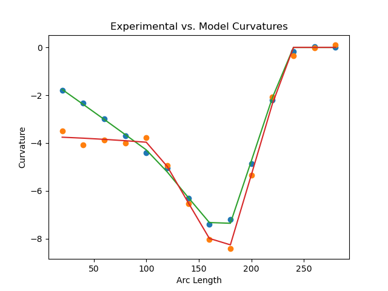
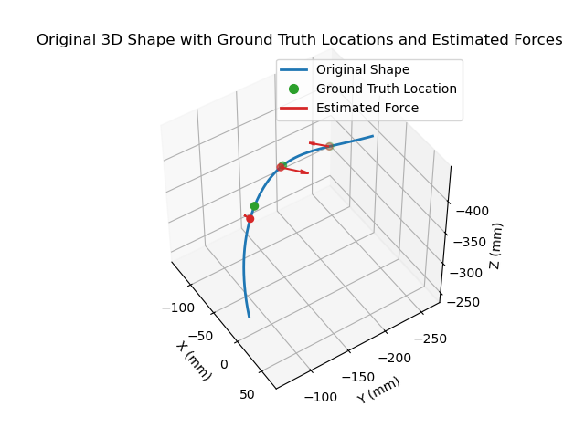

# CurvTube-Force

Project nickname: `CurvTube-Force`

This is the original code for the paper:

Xiao, Qingyu, Xiaofeng Yang, and Yue Chen. "Curvature-based force estimation for an elastic tube." *Robotica* 41.6 (2023): 1749-1761.

The experimental dataset used by this code is included in this repository under `dataset/`.

## Project Layout

```text
CurvTube-Force/
├── dataset/
│   ├── d01/
│   │   ├── d01
│   │   ├── d01_straight
│   │   ├── d01_f.txt
│   │   └── d01_loc.txt
│   └── ...
├── figures/
├── force_estimation_speed/
├── estimation_multi_force.py
└── requirements.txt
```

Each case is grouped into its own folder under `dataset/<case>/`.
Case prefixes follow the original experiment naming:
- `s*`: single-force cases
- `d*`: double-force cases
- `t*`: triple-force cases

## Current Behavior

- The script reads curvature data from `dataset/<case>/`.
- Force-count selection is automatic. It starts from 1 force and adds one more force at a time until:
  - the loss is below `--loss-threshold`, or
  - `--max-forces` is reached.
- The script prints stage logs during execution, including:
  - dataset loading
  - current force count
  - optimization start/finish
  - loss at each stage
- A comparison table is printed for estimated vs. ground-truth location and force magnitude.
- If `--plot` is enabled, the script shows:
  - curvature comparison
  - the original measured 3D shape
  - ground-truth force locations as markers. **Ground-truth force direction is not plotted because the coordinate frames of the FBG sensors and force sensors are not calibrated.**
  - estimated force vectors in 3D

Ground-truth force direction is intentionally not plotted in 3D because the force sensor frame and the FBG-center frame are not calibrated to each other.

## Notes
- The Python script uses `scipy.optimize.minimize(..., method="L-BFGS-B")` for the bounded optimization step.
- Plotting requires `matplotlib`.
- This project is released under the MIT License. See `LICENSE`.

## Install

```bash
pip3 install -r requirements.txt
```

## Run

Run the default search:

```bash
python3 estimation_multi_force.py --dataset d01
```

Limit the maximum number of forces:

```bash
python3 estimation_multi_force.py --dataset d01 --max-forces 8
```

Change the stopping threshold:

```bash
python3 estimation_multi_force.py --dataset d01 --loss-threshold 2.0
```

Use a different dataset directory:

```bash
python3 estimation_multi_force.py --dataset d01 --dataset-dir ./dataset
```

Enable plotting:

```bash
python3 estimation_multi_force.py --dataset t01 --plot
```

## Example Figures

<p align="center">
  
  
</p>

## Citation


```bibtex
@article{xiao2023curvature,
  title={Curvature-based force estimation for an elastic tube},
  author={Xiao, Qingyu and Yang, Xiaofeng and Chen, Yue},
  journal={Robotica},
  volume={41},
  number={6},
  pages={1749--1761},
  year={2023},
  publisher={Cambridge University Press}
}
```
